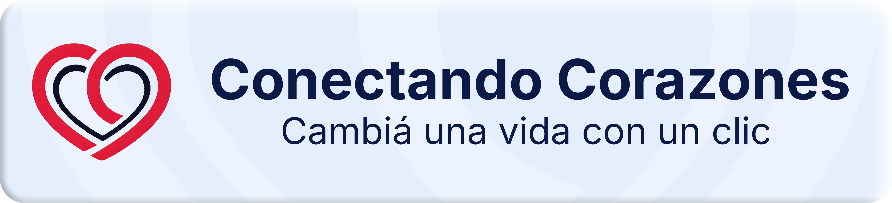

<h1 align="center">📜 Code of Conduct</h1>

<h2>🇪🇸 ESP – Español</h2>

Nos comprometemos a fomentar un entorno inclusivo, respetuoso y seguro para todas las personas que interactúan con este proyecto. Leé y respetá las siguientes pautas al contribuir o participar en la comunidad.

## 💬 Nuestro compromiso

Nosotros, como colaboradores y responsables del proyecto, nos comprometemos a garantizar una experiencia libre de acoso para todas las personas, sin distinción de edad, identidad de género, orientación sexual, discapacidad, etnia, nacionalidad, religión o nivel de experiencia.

Nos esforzamos por construir un entorno amigable, seguro e inclusivo.

## 🤝 Conducta esperada

- Ser respetuoso, amable y constructivo.
- Usar lenguaje acogedor e inclusivo.
- Valorar diferentes puntos de vista y experiencias.
- Aceptar las críticas constructivas con respeto.
- Priorizar el bienestar de la comunidad y del proyecto.
- Apoyar a otros colaboradores y fomentar el trabajo en equipo.

## 🚫 Conducta inaceptable

- Discriminación, acoso o comentarios ofensivos (verbales o escritos).
- Intimidación o amenazas, públicas o privadas.
- Publicación de contenido sexual o violento.
- Ataques personales, lenguaje hiriente o provocaciones.
- Comportamiento disruptivo que interfiera con la participación.

## 📢 Reporte de incidentes

Si presenciás o sufrís alguna conducta inapropiada, reportala de inmediato a:

📩 **Crear un email...**  
Asunto: _Reporte de Código de Conducta_

Todos los reportes serán tratados de forma confidencial.

## 📌 Aplicación

Los responsables del proyecto tienen la facultad de hacer cumplir este código de conducta.  
Podrán eliminar comentarios, aportes o usuarios que lo incumplan, de manera temporal o permanente.

## 📄 Atribución

Este Código de Conducta está adaptado del [Contributor Covenant](https://www.contributor-covenant.org/es/version/2/1/code_of_conduct/), versión 2.1.

<h2>🌐 ENG – English</h2>

We are committed to fostering an inclusive, respectful, and safe environment for everyone who interacts with this project. Please read and adhere to the following guidelines when contributing or engaging with the community.

## 💬 Our Pledge

We as contributors and maintainers pledge to make participation in our community a harassment-free experience for everyone, regardless of age, gender identity, sexual orientation, disability, ethnicity, nationality, religion, or level of experience.

We are committed to building a friendly, safe and inclusive environment.

## 🤝 Expected Behavior

- Be respectful, kind and constructive.
- Use welcoming and inclusive language.
- Respect different viewpoints and experiences.
- Accept constructive criticism with grace.
- Focus on what is best for the community and the project.
- Support fellow contributors and encourage collaboration.

## 🚫 Unacceptable Behavior

- Discrimination, harassment, or offensive comments (verbal or written).
- Public or private intimidation or threats.
- Posting sexual or violent content.
- Trolling, personal attacks, or derogatory comments.
- Disruptive behavior that interferes with community engagement.

## 📢 Reporting

If you witness or experience any unacceptable behavior, please report it immediately to:

📩 **Crear un email...**  
Subject: _Code of Conduct Report_

All reports will be handled confidentially.

## 📌 Enforcement

Project maintainers are responsible for enforcing this code of conduct.  
They have the right to remove comments, commits, code, issues, and contributors that do not comply, temporarily or permanently.

## 📄 Attribution

This Code of Conduct is adapted from the [Contributor Covenant](https://www.contributor-covenant.org/), version 2.1.

