<!-- ! NO CAMBIAR NADA DE ACÁ -->

# Architectural Rules (must follow!)

**When adding or modifying code in this repository:**

1. Do NOT place business logic inside `routes/` or Svelte components.
2. All business rules must live in `src/lib/domain`.
3. Routes and server actions act as controllers only.
4. External services (Supabase, Firebase) are accessed only via `infrastructure`.
5. Domain layer must not depend on SvelteKit, Supabase or Firebase.
6. UI components must be stateless and presentation-focused.
7. Follow the folder responsibilities described in this document.

---

# General folder structure

```txt
src/
├─ routes/                 # Vistas y controladores (BFF SvelteKit)
│
├─ lib/                    # Código compartido y capas internas
│  ├─ domain/              # Dominio y lógica de negocio
│  ├─ infrastructure/      # Acceso a datos e integraciones externas
│  ├─ adapters/            # Adaptadores entre HTTP y dominio
│  ├─ components/          # Componentes UI reutilizables
│  ├─ stores/              # Estado global
│  ├─ utils/               # Utilidades y helpers
│  ├─ validation/          # Esquemas de validación
│  └─ auth/                # Autenticación y permisos
│
├─ static/                 # Archivos públicos (assets)
├─ app.d.ts                # Tipos globales de la app
└─ hooks.server.ts         # Hooks globales del backend

```

## Diagrama de árbol

```mermaid
graph TD
  src[src/]

  src --> routes[routes/]
  src --> lib[lib/]
  src --> static[static/]
  src --> appdts[app.d.ts]
  src --> hooks[hooks.server.ts]

  %% ROUTES
  routes --> public["(public)/"]
  routes --> protected["(protected)/"]
  routes --> api["api/"]

  public --> auth["(auth)/"]
  auth --> login[iniciar-sesion/]
  auth --> register[registrarse/]

  protected --> panel[mi-panel/]
  protected --> reportes[reportes/]

  api --> proyectosApi[proyectos/]
  api --> usuariosApi[usuarios/]

  proyectosApi --> proyectosServer["+server.ts"]
  usuariosApi --> usuariosServer["+server.ts"]

  %% LIB
  lib --> domain[domain/]
  lib --> infrastructure[infrastructure/]
  lib --> adapters[adapters/]
  lib --> components[components/]
  lib --> authlib[auth/]

  %% DOMAIN
  domain --> entities[entities/]
  domain --> usecases["use-cases/"]
  domain --> repositories[repositories/]
  domain --> types[types/]

  entities --> Usuario[Usuario.ts]
  entities --> Proyecto[Proyecto.ts]

  usecases --> crearProyecto[crearProyecto.ts]
  usecases --> reportar[reportarIrregularidad.ts]

  repositories --> ProyectoRepo[ProyectoRepository.ts]
  repositories --> UsuarioRepo[UsuarioRepository.ts]

  %% INFRASTRUCTURE
  infrastructure --> supabase[supabase/]
  infrastructure --> firebase[firebase/]

  supabase --> sbClient[client.ts]
  supabase --> postgres[postgres/]

  postgres --> proyectoRepoImpl[proyecto.repo.ts]
  postgres --> usuarioRepoImpl[usuario.repo.ts]

  firebase --> fbAuth[auth.ts]
  firebase --> fbStorage[storage.ts]
  firebase --> fbRealtime[realtime.ts]

  %% COMPONENTS
  components --> ui[ui/]
  components --> layoutComp[layout/]
  components --> feature[feature/]

  ui --> Button[Button.svelte]
  ui --> Input[Input.svelte]

  feature --> proyectosUI[proyectos/]
  feature --> perfilUI[perfil/]
```



## Capa de presentación (Views)

### `src/routes/`

Responsabilidad:

* Definir vistas (frontend)
* Exponer endpoints backend internos del BFF de SvelteKit
* Orquestar llamadas a la lógica de negocio

Correspondencia MVC:

* **Vista:** `+page.svelte`
* **Controlador:** `+server.ts`, `+page.server.ts`

### Estructura sugerida

```txt
routes/
├─ (public)/
│  ├─ (auth)/
│  │  ├─ iniciar-sesion/
│  │  └─ registrarse/
│  ├─ contacto/
│  ├─ faq/
│  └─ ...
│
├─ (protected)/
│  ├─ +layout.server.ts    # Guard de autenticación
│  ├─ mi-panel/
│  ├─ reportes/
│  ├─ configuracion/
│  └─ ...
│
├─ api/                    # Endpoints del backend
│  ├─ proyectos/
│  │  └─ +server.ts
│  ├─ usuarios/
│  │  └─ +server.ts
│  ├─ instituciones/
│  │  └─ +server.ts
│  └─ ...
│
├─ +page.svelte
└─ +layout.svelte
```

Consideraciones:
* En `routes/api/`, los endpoints no están pensados como una API pública general, sino como endpoints internos del BFF

## Capa de Dominio (Modelo + Lógica de Negocio)

### `src/lib/domain/`

Responsabilidad:

* Definir entidades del sistema
* Contener reglas de negocio
* Implementar casos de uso

Correspondencia MVC:

* **Modelo**

```txt
lib/domain/
├─ entities/               # Entidades del negocio
│  ├─ Usuario.ts
│  ├─ Proyecto.ts
│  └─ Institucion.ts
│
├─ use-cases/               # Casos de uso (lógica de negocio)
│  ├─ crearProyecto.ts
│  ├─ reportarIrregularidad.ts
│  └─ validarInstitucion.ts
│
├─ repositories/           # Contratos (interfaces)
│  ├─ ProyectoRepository.ts
│  ├─ UsuarioRepository.ts
│  └─ InstitucionRepository.ts
│
└─ types/                  # Tipos y enums compartidos
```

> ⚠️ Esta capa **no conoce SvelteKit, Supabase ni Firebase**.

## Capa de Infraestructura (Acceso a Datos y Servicios Externos)

### `src/lib/infrastructure/`

Responsabilidad:

* Implementar repositorios
* Configurar clientes de servicios externos
* Centralizar integraciones

```txt
lib/infrastructure/
├─ supabase/
│  ├─ client.ts            # Cliente Supabase
│  └─ postgres/        # PostgreSQL (Supabase)
│     ├─ proyecto.repo.ts
│     ├─ usuario.repo.ts
│     └─ institucion.repo.ts
│
├─ firebase/
│  ├─ auth.ts              # Firebase Auth
│  ├─ storage.ts           # Firebase Storage
│  └─ realtime.ts          # Firebase Realtime Database
│
└─ config/
   └─ env.ts               # Variables de entorno
```

Correspondencia:

* **Repositorio (DAO / Gateway)**

Aclaraciones:

* Firebase Auth se utiliza como proveedor de identidad
* Las reglas de autorización y permisos se definen en el dominio o adapters

## Capa de Adaptación (Puente entre rutas y dominio)

### `src/lib/adapters/`

Responsabilidad:

* Traducir datos entre HTTP y dominio
* Coordinar casos de uso y repositorios
* **Puede ser excesivo en la mayoría de los casos, utilizar solo en los siguientes casos:**
  * Hay validaciones complejas de entrada
  * Se orquestan múltiples casos de uso
  * Se necesita transformar request/response DTOs HTTP a entidades de dominio

```txt
lib/adapters/
├─ proyectos.adapter.ts
├─ usuarios.adapter.ts
└─ instituciones.adapter.ts
```

Ejemplo:

* Valida datos de entrada
* Ejecuta casos de uso
* Devuelve respuestas serializables

## Capa de UI (Componentes)

### `src/lib/components/`

Responsabilidad:

* Componentes visuales
* No contienen lógica de negocio

```txt
lib/components/
├─ ui/                     # Componentes genéricos
│  ├─ Button.svelte
│  ├─ Input.svelte
│  └─ Select.svelte
│
├─ layout/                 # Header, Footer, Nav
└─ feature/                # Componentes por funcionalidad
   ├─ proyectos/
   └─ perfil/
```

## Estado Global y Utilidades

### `src/lib/stores/`

* Manejo de estado reactivo
* Nunca acceden directamente a la base de datos
* Los stores solo consumen endpoints o adapters, nunca infraestructura directa

### `src/lib/utils/`

* Helpers
* Formateo, validaciones simples, fechas

### `src/lib/validation/`

* Esquemas de validación (Zod u otros)

## Autenticación y Seguridad

### `src/lib/auth/`

* Integración con Firebase Auth
* Helpers de sesión
* Roles y permisos

### `hooks.server.ts`

* Inyección de usuario autenticado
* Validaciones globales

# Mapeo Arquitectónico (resumen)

| Concepto                     | Ubicación                 |
| ---------------------------- | ------------------------- |
| Vista                        | `+page.svelte`            |
| Controlador backend (API / acciones)      | `+server.ts`              |
| Controlador de vista (carga de datos)      | `+page.server.ts`         |
| Modelo                       | `lib/domain/entities`     |
| Caso de Uso                  | `lib/domain/use-cases`    |
| Repositorio (Contrato)       | `lib/domain/repositories` |
| Repositorio (Implementación) | `lib/infrastructure`      |
| UI Reutilizable              | `lib/components`          |