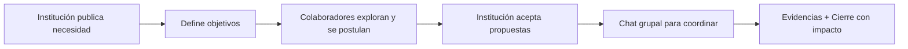

<p align="center">
  <a href="README.md"></a>
  <a href="https://translate.google.com/translate?sl=es&tl=en&u=https://github.com/MVRU/Conectando-Corazones"></a>
</p>


<p align="center">
  
</p>

<p align="center">
  <em>❤️ Plataforma solidaria, transparente y trazable</em><br/>
  <sub>Conectamos instituciones que necesitan ayuda con personas y organizaciones dispuestas a brindarla.</sub>
</p>


<p align="center">
 <a href="https://conectando-corazones.vercel.app/"></a>
  <a href="https://mvru.github.io/Conectando-Corazones/"></a>

</p>

<p align="center">
  <a href="https://github.com/MVRU/Conectando-Corazones/issues">
    
  </a>
</p>


---

## ✨ Highlights

<p align="center">
  
  
  
  
  
</p>

---

## 🍁 Introducción

**Conectando Corazones** es una plataforma digital sin fines de lucro que vincula a instituciones que necesitan ayuda —como escuelas, hospitales y comedores— con personas, ONGs y empresas dispuestas a brindarla en Argentina.

---

## 🎯 Propósito

> **Facilitar la ayuda con trazabilidad total.**  
> Cada proyecto tiene evidencias verificables para garantizar confianza entre instituciones, colaboradores y comunidad.

---

## 🚀 Funcionalidades

<div align="center">

| Característica             | Descripción                                                    |
| -------------------------- | -------------------------------------------------------------- |
| ✅ Registro verificado      | Email institucional, revisión documental, RENAPER (*post-MVP*) |
| 📄 Publicación de proyectos | Solo por instituciones verificadas                             |
| 🤝 Colaboraciones           | Personas, ONGs, empresas                                       |
| 💬 Chat seguro              | Habilitado tras aceptación                                     |
| 📸 Evidencias               | Cierre obligatorio con fotos/documentos                        |
| 📊 Dashboard                | Métricas, seguimiento y recomendaciones                        |
| 💞 Accesibilidad            | Diseño inclusivo y ético                                       |

</div>

> ⚖️ **Aviso legal**: no procesamos pagos, no actuamos como escrow, no garantizamos legitimidad absoluta. La plataforma provee trazabilidad para control ciudadano.

---

## 👥 Usuarios

<div align="center">

| Rol                   | Permisos                                                      | Ejemplos                        |
| --------------------- | ------------------------------------------------------------- | ------------------------------- |
| **🏫 Instituciones**   | Publicar proyectos, gestionar colaboradores, subir evidencias | Escuelas, comedores, hospitales |
| **🤲 Colaboradores**   | Postularse, enviar recursos, participar en chats              | Voluntarios, empresas, ONGs     |
| **🛡️ Administradores** | Verificar cuentas, moderar contenido, auditar proyectos       | Equipo técnico y ético          |

</div>


### Cómo funciona (en 6 pasos)



---

## 💻 Stack Tecnológico

<div align="center">

<table>
  <tr>
    <td align="center" width="33%">
      <h3>Frontend</h3>
      
    </td>
    <td align="center" width="33%">
      <h3>Backend</h3>
      
    </td>
    <td align="center" width="33%">
      <h3>Infraestructura</h3>
      
    </td>
  </tr>
</table>

</div>

---

## 📖 Documentación

<p align="center">
  <a href="https://mvru.github.io/Conectando-Corazones/">
    
  </a>
</p>

<div align="center">

| Sección         | Contenido                                   |
| --------------- | ------------------------------------------- |
| 📘 Guía Usuarios | Cómo publicar, colaborar y subir evidencias |
| 🤝 Guía Devs     | Diagramas, ADRs y decisones técnicas        |
| 🔐 Marco Legal   | Datos y políticas de privacidad             |

</div>

---

## 📂 Estructura del Repositorio

```plaintext
📦 Conectando-Corazones
├── 🟦 frontend/       → SvelteKit + TailwindCSS
├── ⬛ backend/         → Express + Prisma + PostgreSQL
├── 🟨 docs-site/       → Documentación con Docusaurus
├── 📂 .github/         → Workflows, issues, CODE_OF_CONDUCT
├── 📄 CONTRIBUTING.md  → Guía de contribución
├── 📄 LICENSE          → AGPL-3.0
└── 📄 SECURITY.md      → Política de seguridad
```

---

## 🤝 Contribuir

<p align="center">
  
</p>

### 🛠️ Comenzá así:

```bash
# 1. Clonar el repositorio
git clone https://github.com/MVRU/Conectando-Corazones.git

# 2. Instalar dependencias
cd frontend && npm install
cd ../backend && npm install

# 3. Crear una rama
git checkout -b feature/descripcion-clara
```

> 👉 **Guía completa** → [`CONTRIBUTING.md`](./CONTRIBUTING.md)

---

## 🛡️ Comunidad y Seguridad

- 📜 [Código de Conducta](./.github/CODE_OF_CONDUCT.md)  
- 🔐 [Política de Seguridad](./.github/SECURITY.md)  
- 🧾 [Licencia AGPL-3.0](./LICENSE)

### 🔒 Datos y privacidad

<div align="center">

| Política            | Acciones                                                     |
| ------------------- | ------------------------------------------------------------ |
| **Privacidad**      | Datos mínimos, cifrado en Firebase, eliminación de metadatos |
| **Acceso**          | Restringido a roles autorizados                              |
| **Responsabilidad** | Control total del usuario sobre su información               |
| **Ética**           | Difuminado de rostros, protección de menores                 |

</div>

---

## 🎓 Créditos

Proyecto desarrollado como trabajo final de **Ingeniería en Sistemas de Información** – **UTN FRRo**.

<div align="center">

|                     Alexis Julián Sklate                      |                   Marina Ana Milo                    |                     Martín Tomás Álvarez                      |
| :-----------------------------------------------------------: | :--------------------------------------------------: | :-----------------------------------------------------------: |
|  |  |  |
|      [@AleSklate0807](https://github.com/AleSklate0807)       |           [@MVRU](https://github.com/MVRU)           |      [@TomasAlvarez0](https://github.com/TomasAlvarez0)       |

</div>

---

## 📬 Contacto

<p align="center">
  <a href="https://github.com/MVRU/Conectando-Corazones/issues"></a>
  <a href="https://github.com/MVRU/Conectando-Corazones/discussions"></a>
  <a href="mailto:conectando.corazones.contacto@gmail.com"></a>
</p>

---

<div align="center">
  <sub>❤️ Hecho con propósito, código limpio y mucho corazón.</sub>
</div>

<p align="center">
  
</p>