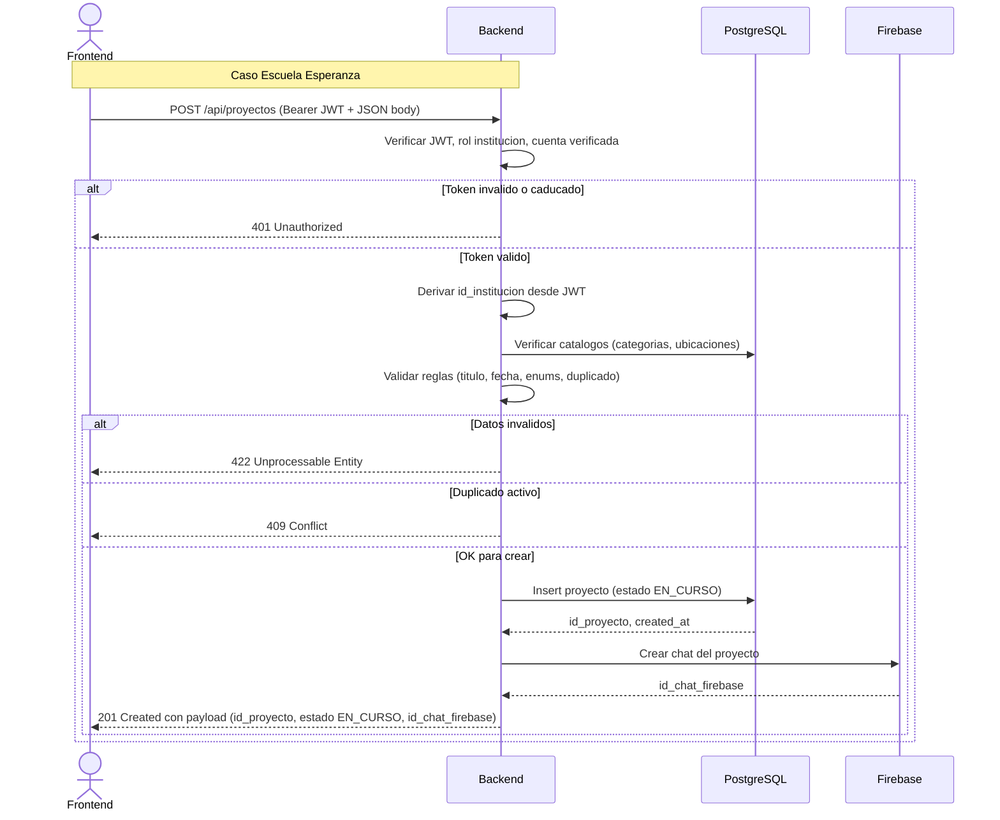
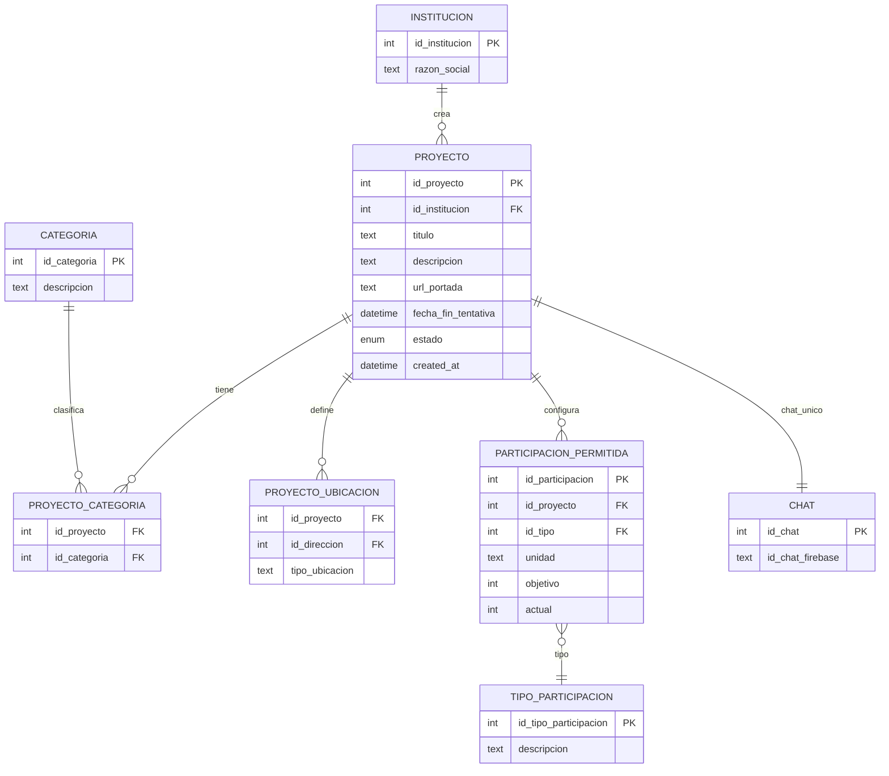

import Authors from '@site/src/components/Authors';

<Authors names={['marina']} />

## POST /api/proyectos

Este endpoint permite **registrar un nuevo proyecto** en la plataforma, asociándolo automáticamente a la institución del usuario autenticado. 

### Resumen del funcionamiento

1. **Definís** qué proyecto querés crear (datos básicos, ubicaciones, tipos de participación).
2. **El sistema lo vincula** con tu institución (sin que tengas que enviar el `id_institucion`).
3. **Se asigna un estado inicial** (`EN_CURSO`) y se genera un chat para la coordinación.
4. **Si todo está correcto**, el sistema guarda el proyecto y te devuelve los datos confirmados.
5. **Si algo falla**, no se crea el proyecto y recibirás un código de error con detalles.

:::caution Requisito
Para crear un proyecto, el usuario debe:
- Tener un **token válido**.
- Contar con el **rol "institución" activo**.
- Tener la cuenta **verificada**.
:::

---

## Cómo interpretar Request y Response

**Podés pensar que:**

* **El Request es tu formulario**: completás los datos que describen el proyecto.
* **El Response es tu comprobante**: el sistema te devuelve lo que guardó, más los datos que generó automáticamente (fechas, IDs, estado inicial, chat).
  - **Si algo falla:** el sistema no crea el proyecto y te devuelve un código de error con un mensaje para que sepas qué corregir.

---

## Ejemplo de Request (Petición)

Imaginemos que la **Escuela Esperanza** quiere iniciar un proyecto para comprar 100 libros de lectura y además organizar un taller semanal con 10 docentes voluntarios para fomentar la comprensión lectora en niños de 7 a 10 años.

**El equipo directivo ya definió:**
  * **Fecha de finalización:** fines de septiembre de 2025.
  * **Dos ubicaciones:**
    1. Entrega de libros.
    2. Taller de lectura.
  * **Tipos de participación:**
    * Donar libros (en especie).
    * Participar en el taller de lectura (voluntariado).

**Así se vería el request enviado al API:**

```json
{
  "titulo": "Lecturas que unen",
  "descripcion": "Compra de 100 libros y realización de un taller semanal con 10 docentes voluntarios para alumnos de 3er y 4to grado.",
  "url_portada": "https://example.com/portada.jpg",
  "fecha_fin_tentativa": "2025-09-30T12:00:00Z",
  "categorias": ["EDUCACION", "NIÑEZ"],
  "ubicaciones": [
    { "id_ubicacion": 4346753, "tipo_ubicacion": "entrega de libros" },
    { "id_ubicacion": 1563246, "tipo_ubicacion": "taller de lectura" }
  ],
  "tipos_participacion": [
    { "tipo": "EN_ESPECIE", "unidad": "libros", "objetivo": 100 },
    { "tipo": "VOLUNTARIADO", "unidad": "docentes", "objetivo": 10 }
  ]
}
```

:::note Notas de seguridad
* `id_institucion` **NO** se envía: el backend lo infiere del token JWT.
* `estado` inicial **NO** se envía: el sistema lo asigna por defecto (`EN_CURSO`).
* Los enums se envían como strings semánticos y se documentan más abajo.
:::

---

## Ejemplo de Response (Respuesta)

**Cuando el backend valida los datos y crea el proyecto, devuelve:**

1. Los datos que enviaste, confirmados y normalizados.
2. Campos generados automáticamente (`id_proyecto`, `created_at`, `id_chat_firebase`, `estado`).
3. Enums normalizados a su formato oficial.

```json
{
  "id_proyecto": 87,
  "titulo": "Lecturas que unen",
  "descripcion": "Compra de 100 libros y realización de un taller semanal con 10 docentes voluntarios para alumnos de 3er y 4to grado.",
  "url_portada": "https://example.com/portada.jpg",
  "fecha_fin_tentativa": "2025-09-30T12:00:00Z",
  "estado": "EN_CURSO",
  "categorias": ["EDUCACION", "NIÑEZ"],
  "ubicaciones": [
    { "id_ubicacion": 4346753, "tipo_ubicacion": "entrega de libros" },
    { "id_ubicacion": 1563246, "tipo_ubicacion": "taller de lectura" }
  ],
  "tipos_participacion": [
    { "tipo": "EN_ESPECIE", "unidad": "libros", "objetivo": 100 },
    { "tipo": "VOLUNTARIADO", "unidad": "docentes", "objetivo": 10 }
  ],
  "created_at": "2025-07-01T12:00:00Z",
  "id_chat_firebase": "chat_proyecto_87"
}
```

---

## Códigos de estado

| Código                      | Significado                                 |
| --------------------------- | ------------------------------------------- |
| `201 Created`               | Proyecto creado correctamente ✅             |
| `400 Bad Request`           | Datos mal formateados o incompletos         |
| `401 Unauthorized`          | Token inválido o caducado                   |
| `403 Forbidden`             | Usuario sin permisos para crear proyectos   |
| `409 Conflict`              | Proyecto similar ya existe en estado `en_curso` |
| `422 Unprocessable Entity`  | Error de validación lógica                  |
| `500 Internal Server Error` | Error inesperado en el servidor             |

---

## Validaciones y lógica de negocio

* **`titulo`**
  obligatorio; 5–100 caracteres; sin solo espacios; evitar duplicado "en curso" reciente para la misma institución.
* **`descripcion`**
  opcional; si se envía, 10–1000 caracteres.
* **`url_portada`**
  opcional; debe ser HTTPS, formato de imagen permitido (jpg, png, webp) y tamaño ≤ 5 MB.
* **`fecha_fin_tentativa`**
  obligatoria; debe ser futura y ≤ 2 años desde la fecha de creación.
* **`categorias`**
  lista no vacía; códigos válidos según catálogo activo; sin duplicados.
* **`ubicaciones`**
  lista opcional; `id_ubicacion` existente; `tipo_ubicacion` válido; sin duplicados.
* **`tipos_participacion`**
  lista no vacía; `tipo` válido (enum); `objetivo` > 0; sin repeticiones del mismo tipo+unidad.
* **`id_chat_firebase`**
  generado automáticamente; no editable.
* **Autorización:**
  el creador debe tener rol "institución" activo y estar verificado; la institución se obtiene del token.

---

## Enums relevantes

### ¿Qué es un enum?

En programación, un **enum** (enumeración) es una lista cerrada de valores predefinidos.  
En lugar de usar números o texto libre, usamos **códigos estándar** que el sistema entiende siempre igual.  

**Esto:**
- Reduce errores de escritura.
- Evita confusiones entre valores similares.
- Permite validar fácilmente lo que se recibe.

**Ejemplo:**
```text
estado → EN_CURSO, COMPLETADO, CANCELADO
````

En vez de `1`, `2`, `3` (que serían difíciles de recordar), usamos nombres claros.


:::tip
Los enums sirven para estandarizar valores y evitar errores de interpretación. Es útil para no tener que memorizar IDs numéricos. 
:::

### Enum `estado`

| Enum                         | Descripción                             |
| ---------------------------- | --------------------------------------- |
| `EN_CURSO`                   | Proyecto ejecutándose (valor por defecto)     |
| `PENDIENTE_SOLICITUD_CIERRE` | Objetivos cumplidos, preparando evidencias  |
| `EN_REVISION`                | Revisión de evidencia por colaboradores |
| `EN_AUDITORIA`               | Auditoría por actividad sospechosa      |
| `COMPLETADO`                 | Concluido exitosamente                  |
| `CANCELADO`                  | Cancelado por institución o auditoría   |


### Enum `tipo` (tipos de participación)

| Enum           | Descripción                                       | Unidades de ejemplo (en plural)                     |
| -------------- | ------------------------------------------------- | ------------------------------------ |
| `MONETARIA`    | Aporte en dinero (no procesado por la plataforma) | `ARS`, `USD`, `EUR`                  |
| `EN_ESPECIE`   | Donaciones físicas                                | `libros`, `alimentos`, `kg`, `litros` |
| `VOLUNTARIADO` | Tiempo o rol                              | `docentes`, `personas`, `horas`      |


---

## Anexos

### Anexo A: Secuencia de Frontend, Backend, DB y Chat



---

### Anexo B: Mapa de entidades y vínculos (ER)

:::caution
El diagrama que se muestra a continuación es a **modo de referencia**, no reemplaza el DER oficial.
:::



---

## Notas adicionales

* Considerar la implementación de una validación de idempotencia usando `Idempotency-Key` para evitar duplicados en caso de reintentos.