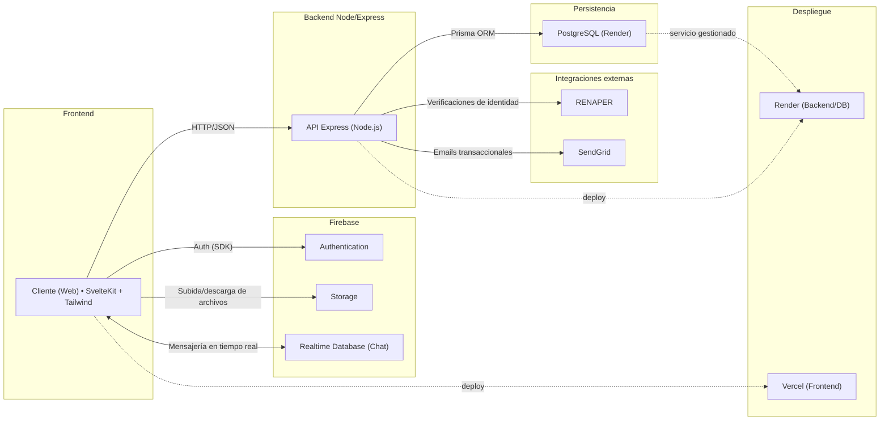

import Tabs from '@theme/Tabs';
import TabItem from '@theme/TabItem';

## Vista general

* **[Frontend](https://github.com/MVRU/conectando-corazones/tree/main/frontend):** [SvelteKit 5](https://kit.svelte.dev/docs) + [Tailwind CSS 4.7.1](https://tailwindcss.com/docs).
* **[Backend](https://github.com/MVRU/conectando-corazones/tree/main/backend):** [Node.js](https://nodejs.org/en/docs) + [Express](https://expressjs.com/).
  * **Prisma ORM** sobre **PostgreSQL** (gestionado en **Render**).
* **Integraciones y servicios:**
  * **Firebase** (Authentication, Storage, Realtime Database para chat)
  * **Axios** (consumo de APIs externas)
  * **RENAPER**
  * **SendGrid** (emails transaccionales)
* **Testing:** **Vitest** + **Testing Library** (unitarias e integración), **Playwright** (E2E), **Supertest** (HTTP).
* **Despliegue:** **Vercel** (frontend), **Render** (backend y base de datos), **Firebase** (auth, almacenamiento y mensajería en tiempo real).

## Decisión de diseño

- La combinación **SvelteKit + Node/Express** en **TypeScript** garantiza un desarrollo full-stack tipado y coherente.
- **Prisma** y **PostgreSQL** aportan portabilidad y rendimiento en consultas.
- **Firebase** reduce complejidad operativa para **autenticación**, **almacenamiento** y **chat** mediante **Realtime Database**.
- **Render** y **Vercel** simplifican el despliegue continuo con costes operativos bajos.
- **Axios** permite integrar de forma controlada **RENAPER/SendGrid** desde el backend, manteniendo el control de seguridad y trazabilidad.

<Tabs>
  <TabItem value="normal" label="Vista normal" default>

  </TabItem>
  <TabItem value="ampliado" label="Vista ampliada">

  

  

  </TabItem>
</Tabs>

```mermaid
graph LR
  %% =============== BLOQUES PRINCIPALES ===============
  subgraph "Frontend"
    A["Cliente (Web) • SvelteKit + Tailwind"]
  end

  subgraph "Backend Node/Express"
    B["API Express (Node.js)"]
  end

  subgraph "Persistencia"
    C["PostgreSQL (Render)"]
  end

  subgraph "Firebase"
    F1["Authentication"]
    F2["Storage"]
    F3["Realtime Database (Chat)"]
  end

  subgraph "Integraciones externas"
    X1["RENAPER"]
    X2["SendGrid"]
  end

  subgraph "Despliegue"
    V["Vercel (Frontend)"]
    R["Render (Backend/DB)"]
  end

  %% =============== FLUJOS PRINCIPALES ===============
  A -- "HTTP/JSON" --> B
  B -- "Prisma ORM" --> C

  %% Autenticación y evidencia
  A -- "Auth (SDK)" --> F1
  A -- "Subida/descarga de archivos" --> F2

  %% Chat en tiempo real
  A <-- "Mensajería en tiempo real" --> F3

  %% Integraciones backend
  B -- "Verificaciones de identidad" --> X1
  B -- "Emails transaccionales" --> X2

  %% Despliegue (enlaces informativos, punteados)
  A -. "deploy" .-> V
  B -. "deploy" .-> R
  C -. "servicio gestionado" .-> R
```

### Leyenda

* **Cliente (Web):** interfaz en **SvelteKit + Tailwind**.
* **API Express:** backend en **Node.js/Express**.
* **PostgreSQL (Render):** base de datos relacional gestionada; acceso mediante **Prisma**.
* **Firebase Authentication:** login/registro/token management para clientes web.
* **Firebase Storage:** almacenamiento de archivos como evidencias (imágenes/documentos).
* **Firebase Realtime Database (Chat):** **chat en tiempo real** (suscripción desde el cliente).
* **RENAPER/SendGrid:** integraciones vía **Axios** desde el backend (verificaciones y envío de emails).
* **Vercel/Render:** plataformas de despliegue para frontend y backend/DB.