import Tabs from '@theme/Tabs';
import TabItem from '@theme/TabItem';

> Esta versión refleja el estado **actual** del esquema. Si cambia el modelo, actualizá este diagrama y el **Diccionario de datos**.

{/* TODO: agregar enlace a DER interactivo con draw.io */}

```mermaid
erDiagram
  Usuario ||--o{ Participacion : realiza
  Proyecto ||--o{ Participacion : recibe
  Institucion ||--o{ Proyecto : crea
  Proyecto ||--o{ Evidencia : contiene
  Proyecto ||--o{ Objetivo : define
  Usuario {
    uuid id PK
    string nombre
    string email
    date   creadoEn
  }
  Institucion {
    uuid id PK
    string nombre
    string cuit
  }
  Proyecto {
    uuid id PK
    string titulo
    string estado  "Abierto|En ejecución|Finalizado"
    date   fechaInicio
    date   fechaCierre
    string provincia
  }
  Evidencia {
    uuid id PK
    string tipo    "foto|doc|recibo"
    string url
    date   fecha
    string hash
  }
  Participacion {
    uuid id PK
    string tipo "Monetaria|Voluntariado|Materiales"
    decimal monto
  }
  Objetivo {
    uuid id PK
    string descripcion
    int    cantidad
    string unidad
  }
```

<Tabs>
  <TabItem value="mermaid" label="Mermaid (editable)">
  

  </TabItem>
  <TabItem value="png" label="Imagen">
{/*  */}
  </TabItem>
</Tabs>