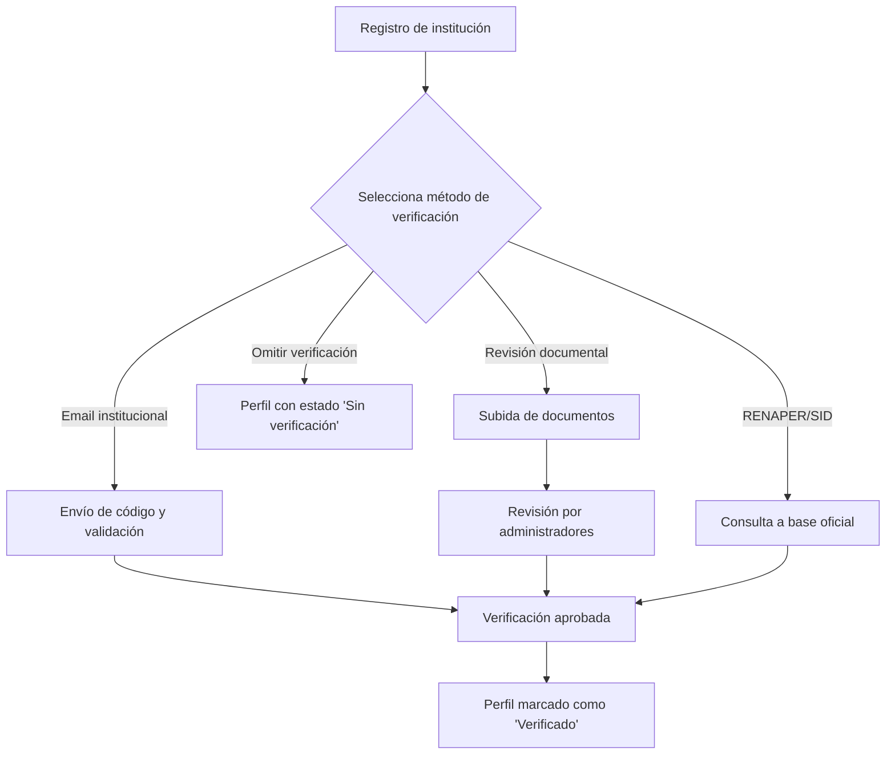

:::info
Este apartado responde al **"Quién"** del principio rector. La verificación de identidad asegura que las instituciones registradas son reales y confiables antes de que puedan publicar proyectos.
:::

---

## Objetivos

Garantizar que cada institución registrada esté vinculada a una **identidad auténtica y comprobada**, reduciendo riesgos de fraude y aumentando la confianza de colaboradores y donantes.

---

## Métodos de verificación disponibles

### 1. Email de dominio institucional  
- **Descripción:** se valida una dirección de correo con dominio propio (ej. `@escuela.edu.ar`).  
- **Ventajas:** simple, gratuito e instantáneo.  
- **Limitaciones:** no cubre instituciones sin dominio propio.  
- **Flujo:** se envía un código de verificación al correo, que debe ser ingresado en la plataforma.
- **Badge:** `Verificado por email institucional`

---

### 2. Revisión documental (manual)  
- **Descripción:** la institución sube PDF o imágenes de documentos oficiales.  
- **Ventajas:** funciona como alternativa cuando los otros métodos fallan.  
- **Proceso:**  
  1. El equipo de administración revisa los documentos.  
  2. El perfil muestra el badge **"Verificación pendiente"** hasta la aprobación.  
  3. Durante este tiempo, se pueden crear **borradores** de proyectos pero no publicarlos.  
- **Mejora futura (opcional):** uso de OCR (reconocimiento óptico de caracteres) para asignar un puntaje de confiabilidad y agilizar la revisión.
- **Badge:** `Verificado por revisión documental`

---

### 3. Integración con RENAPER / SID *(post-MVP)*  
- **Descripción:** validación contra bases oficiales del Registro Nacional de las Personas o Sistema de Identidad Digital.  
- **Estado:** pendiente, requiere convenios y costos por consulta.
- **Badge:** `Verificado por RENAPER/SID`

---

### 4. Sin verificación (opción: "Omitir por ahora") 
- **Restricciones:** no se pueden crear proyectos.  
- **Badge:** `Sin verificación`

---

## Anexos

### Anexo A: Consideraciones legales y de privacidad

- No se almacenarán datos sensibles como CUIL/CUIT ni números de documento en la base de datos.
    - No lo veo factible ni para la UX ni para el MVP. Si se guardaran tendrían que hashearse, además.
    - **Ley 25.326:** política de privacidad clara, finalidades, derechos del titular; y registrar la base de datos ante [AAIP](https://www.argentina.gob.ar/aaip/datospersonales/tramites).

        :::important Riesgos
        Se pueden enfrentar **multas y sanciones por no registrar ante AAIP**. Puede ser considerada un agravante en caso de incidentes de seguridad o reclamos de usuarios.
        :::
    - **Excepciones (con consentimiento, estos datos solo los ven los colaboradores aprobados en un proyecto en curso):** dirección, formas de contacto, información de representante legal (no se almacena su documento).

---

### Anexo B: Diagrama con estados y métodos de verificación

Cada perfil institucional muestra:  
- **Estado de verificación:**  
  - `"Sin verificación"`  
  - `"Verificación pendiente"`  
  - `"Verificado"`  
- **Método de verificación utilizado:** texto que describe el método empleado (ej. "Email institucional", "Documental", etc.).

### Anexo C: Wireframes

#### Seleccionar método de verificación

#### Verificación por email institucional

#### Verificación documentación manual

