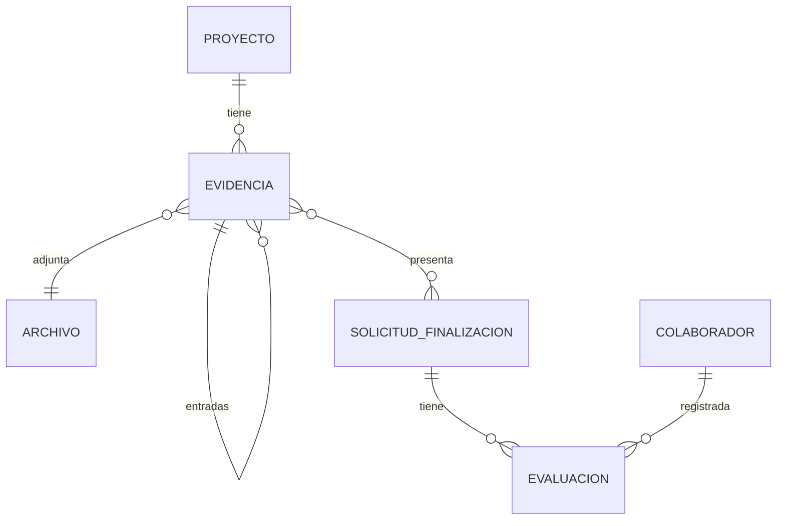

# Evidencias

:::info
Este apartado cubre **"A dónde fue"** y **"En qué se usó"** del principio rector. El objetivo es garantizar una **trazabilidad verificable**, con un flujo ágil, seguro y auditable, protegiendo la privacidad y cumpliendo con las leyes argentinas.
:::


---

## Objetivos

- Documentar **entradas** (recursos recibidos) y **salidas** (uso de recursos) de forma vinculada.
- Permitir que colaboradores e instituciones **revisen, aprueben o rechacen** evidencias.
- Cumplir requisitos **fiscales, legales y de protección de datos**.
- Evitar proyectos estancados mediante **plazos máximos** y cierres automáticos.
- Proteger la privacidad y derechos de imagen de las personas involucradas.

---

## Tipos de evidencias aceptadas

### 1. Evidencias fiscales: donaciones monetarias
Es el caso más sensible y con mayor exigencia de respaldo documental.

#### Ejemplo de flujo
```mermaid
flowchart TD
    A[Colaborador dona dinero] --> B[ENTRADA:
    Colaborador sube comprobante de pago]
    B --> C[Institución recibe fondos y actualiza progreso de objetivo]
    C --> D[SALIDA:
    Institución sube comprobantes de gasto]
    D --> E[Comparación 
    ENTRADA-SALIDA]
    E -->|Aprobado| F[Cierre objetivo]
    E -->|Rechazado| G[Corrección y nueva versión]
````

#### Entradas: **a dónde fue**

| Quién sube  | Tipo de documento            | Datos visibles requeridos                                          | Datos almacenados (BD/Firebase)                                                     |
| ----------- | ---------------------------- | ------------------------------------------------------------------ | --------------------------------------------------------------------------- |
| Colaborador | Transferencia bancaria / PSP | CBU/CVU, ID de operación, fecha, monto, plataforma y medio de pago | Archivo cifrado, fecha emisión, id\_colaborador, descripción, tipo de medio |
| Colaborador | Depósito en efectivo         | Banco receptor, sucursal, número de comprobante, fecha, monto      | Igual que arriba                                                            |

#### Salidas: **en qué se usó**

| Quién sube  | Tipo de documento                     | Datos visibles requeridos                                                             | Datos almacenados (BD/Firebase)                                                         |
| ----------- | ------------------------------------- | ------------------------------------------------------------------------------------- | ------------------------------------------------------------------------------- |
| Institución | Recibo oficial **`en duda`**                       | Nombre y CUIT, número, fecha, monto, firma/sello                                      | Archivo cifrado, fecha emisión, id\_institución, referencia a evidencia de pago |
| Institución | Factura AFIP                          | Tipo (A,B,C), CUIT emisor, punto de venta, número, fecha, detalle gasto, importe, IVA | Igual que arriba                                                                |
| Institución | Ticket fiscal/comprobante electrónico | Razón social y CUIT comercio, fecha, número, detalle, monto                           | Igual que arriba                                                                |

#### Revisión

* **Revisores:** institución y colaboradores en la solicitud de cierre del proyecto.
    * La institución, al recibir la evidencia del pago, actualiza el progreso registrando el monto de la transferencia.
* **Comparación:** entrada(s) y salida(s) relacionadas.
* **Rechazo:** requiere motivo (monto no coincide, fechas, documento ilegible, etc.).
* **Versionado inmutable:** nuevas versiones no sobrescriben el original.

#### Reglas adicionales

* N entradas ↔ M salidas (uno-a-muchos y muchos-a-uno permitidos).
* Coherencia temporal `fecha_entrada <= fecha_salida`.
* Moneda fijada al crear el proyecto (`ARS`, `USD`, …), no modificable.
* **Versionado inmutable:** reemplazos crean nueva versión; se conserva hash de integridad.
* **Retención:** conservar por **X años** (p.ej., 2) y eliminación definitiva, o conservar hasta estado **Completado** (definir política del proyecto).

---

### 2. Evidencias no fiscales: donaciones en especie y voluntariado

#### ¿Qué se acepta?

* **Fotos, actas** y registros de actividad.
* Puede subir **institución** y/o **colaboradores**.
* Se pueden mostrar como **galería del proyecto** (opcional).

#### Privacidad y consentimiento (obligatorio)

* **Checkbox al subir fotos:**
  * "Declaro contar con el **consentimiento explícito** de las personas que aparecen en las imágenes.".
  * "No subiré imágenes de **menores** sin consentimiento de padres/madres o tutores.".
* **Protección automática:** el sistema aplica **blur de caras por defecto**; el usuario puede **desactivar** el blur solo si confirma consentimiento explícito.
    > "Aplicaremos **difuminado automático de rostros** para proteger identidades. Podrá desactivarlo si confirma el consentimiento."
* **Metadatos:** se eliminan metadatos sensibles (ej. **EXIF GPS**).
    > "Eliminamos metadatos sensibles como la ubicación (EXIF)."
* **Acceso:** restringido a participantes del proyecto.
    > "Tus archivos se **cifran** y solo pueden verlos los participantes del proyecto."

#### Ejemplo de flujo

```mermaid
flowchart TD
    A[Donación en especie o voluntariado] --> B[Subida de evidencia no fiscal]
    B --> C[Institución solicita cierre de proyecto]
    C -->|Aprobación explícita| D[Proyecto completado]
    C -->|Rechazo explícito| B
    C -->|Sin respuesta hasta T| F[Auto-cierre por silencio positivo]
    F --> D
```

* **Criterio por defecto:** si **no hay rechazos**, hay ≥1 aprobación y transcurre `T` tiempo, **auto-cierre** a Completado.

> **T (parámetro o timeout configurable en panel-admin):** ej., **7 días** desde la solicitud de cierre.

> **umbral_aprobados (si se quiere endurecer la lógica):** desde el panel-admin se podría definir una cantidad o un porcentaje mínimo de aprobados para auto-cierre.

---

## Reglas generales de archivo y seguridad

* **Formatos permitidos:** PDF, JPG, PNG, WEBP.
* **Tamaño máximo:** ej., **5 MB por archivo** (parámetro configurable en panel-admin).
* **Control de acceso** por rol y pertenencia al proyecto.
* **Registro de auditoría**: quién sube, quién ve, quién aprueba/rechaza, timestamps.

---

## Modelo de datos

:::important Importante
El siguiente modelo de datos es a modo de ejemplo y **no reemplaza al diagrama E-R original**.
:::



> La tabla `EVIDENCIA` presenta un ciclo, donde una evidencia del tipo `salida` se puede vincular con 1 o muchas evidencias del tipo `entrada`.

---

## Anexos

### Anexo A: Ejemplos visuales de entradas (Colaborador)

:::tip Nota
Estos documentos que sube el **colaborador** sirven para evidenciar a dónde fue el dinero.
:::

#### 1. Transferencia bancaria


**Datos visibles requeridos:**
- CBU/CVU
- ID de operación
- Fecha
- Monto
- Plataforma (nombre de banco, MercadoPago, etc.)
- Medio de pago

#### 2. Depósito en efectivo


**Datos visibles requeridos:**
- Banco receptor
- Sucursal
- Número
- Fecha
- Monto

---

### Anexo B: Ejemplos visuales de salidas (Institución) 

:::tip Nota
Estos documentos que sube la **institución** sirven para evidenciar en qué se utilizó.
:::

#### 1. Factura AFIP


**Datos visibles requeridos:**
- Tipo (A, B, C)
- CUIT emisor
- Punto de venta
- Número
- Fecha
- Detalle del gasto
- Importe
- IVA

#### 2. Ticket fiscal / comprobante electrónico


**Datos visibles requeridos:**
- Razón social o CUIT
- CUIT del comercio
- Fecha
- Número
- Detalle del gasto
- Importe
- IVA


### Anexo C: Wireframes

#### 1. Estado de solicitud de cierre de proyecto


#### 2. Evaluación de evidencia fiscal (donación monetaria) comparando entrada-salida


:::tip Nota
Recordar que una salida puede tener `N` entradas distintas. **Considerando casos como:**
- Varios colaboradores aportaron monetariamente.
- El objetivo es muy grande y se realizó en diferentes pagos.
:::

### Anexo D: Referencias legales

* **Ley 25.326** — Protección de Datos Personales ([AAIP](https://www.argentina.gob.ar/aaip/datospersonales))
* **Ley 26.061** — Protección Integral de los Derechos de Niñas, Niños y Adolescentes.
* **Ley 11.723** — Propiedad Intelectual (derecho a la imagen).
* **AFIP** — Requisitos legales para comprobantes válidos.