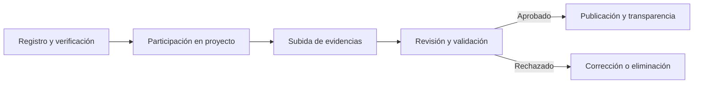

:::info
Este documento es un **resumen informativo** de todos los documentos legales y normativos de **Conectando Corazones**:

- Términos y Condiciones de Uso  
- Política de Privacidad y Cookies  
- Política de Evidencias y Verificación  
- Código de Conducta y Uso Aceptable  
- Aviso Legal  

No reemplaza al documento legal completo, disponible en [este enlace](/pdf/politicas-condiciones.pdf).
:::

---

## Conceptos clave

| Término | Definición breve |
| ------- | ---------------- |
| **Plataforma** | Conectando Corazones, sus sitios web y servicios asociados. |
| **Usuario** | Persona física de al menos 18 años que utiliza la plataforma (representante de institución o colaborador). |
| **Institución** | Organización registrada que solicita o recibe ayuda. |
| **Colaborador** | Persona física o jurídica que aporta recursos, tiempo o servicios. |
| **Evidencia** | Documento, imagen, video o archivo digital que respalda el cumplimiento de un objetivo del proyecto. |

---

## Aceptación y elegibilidad
- Tener **18 años o más**.
- El uso de la plataforma implica la **aceptación total** de las políticas.  
- El registro requiere datos veraces y, en algunos casos, **verificación de identidad**.

---

## Naturaleza y alcance del servicio
- **Sin fines de lucro**: no genera ganancias para los desarrolladores.  
- **Rol de facilitador**: coordinación y almacenamiento seguro de evidencias.  
- **NO** actúa como fiducia, escrow o intermediario financiero.  
- **NO** procesa pagos ni garantiza resultados de los proyectos.

---

## Reglas de uso
### Permitido:
- Subir evidencias reales y verificables.
- Usar la plataforma para fines solidarios.
- Mantener comunicación respetuosa.

### Prohibido:
- Falsificar o manipular evidencias.
- Publicar datos personales sin autorización.
- Spam, scraping no autorizado o malware.
- Uso político partidario sin autorización.

---

## Evidencias y verificación
- Solo pueden subir evidencias **instituciones verificadas** y **colaboradores autorizados**.  
- **Tipos:** fotos, documentos, comprobantes digitales (QR, firma digital).  
- **Prohibido**: datos personales innecesarios, fotos de menores sin consentimiento escrito, geolocalización exacta irrelevante.  
- **Controles:** validaciones automáticas, revisión humana y auditorías muestrales.  
- **Publicación:** solo con fines de transparencia, con anonimización si es necesario.  

---

## Propiedad intelectual
- El contenido que subas sigue siendo tuyo, pero otorgás una licencia limitada para su uso en la plataforma.
- La marca, software y diseño son propiedad de Conectando Corazones.
- Respetamos la Ley 11.723 y derechos de autor de terceros.

---

## Responsabilidad
- Servicio provisto “tal cual” y “según disponibilidad”.
- **No nos hacemos responsables por:**
  - Daños indirectos o pérdida de oportunidades.
  - Acciones de otros usuarios.
- **Límite de responsabilidad:** el monto abonado (si aplica) o un valor simbólico.

---

## Moderación y sanciones
- Contenido que infrinja la ley o políticas puede ser eliminado.
- **Sanciones:**
  1. Advertencia escrita.
  2. Suspensión temporal.
  3. Eliminación de cuenta.
- Reincidencia o gravedad = sanciones más severas.

---

## Privacidad y tratamiento de datos
- **Responsable:** [Razón social], Rosario, Santa Fe, Argentina.  
- **Finalidades:** crear cuentas, verificar identidad, coordinar proyectos, almacenar evidencias, prevenir fraude y cumplir obligaciones legales.  
- **Principios:** licitud, finalidad, minimización, exactitud, seguridad, responsabilidad proactiva.  
- No se registran logs técnicos (IP, dispositivo, navegador) ni ubicación de personas.  
- **Derechos:** acceso, rectificación, actualización, supresión y oposición.

---

## Resumen visual del flujo de participación

---

## Contacto

* **Correo:** \[Correo oficial de contacto]
* **Teléfono:** \[PENDIENTE]
* **Dirección:** \[Domicilio legal completo]
* **Autoridad de control:** [AAIP](https://www.argentina.gob.ar/aaip/datospersonales)
