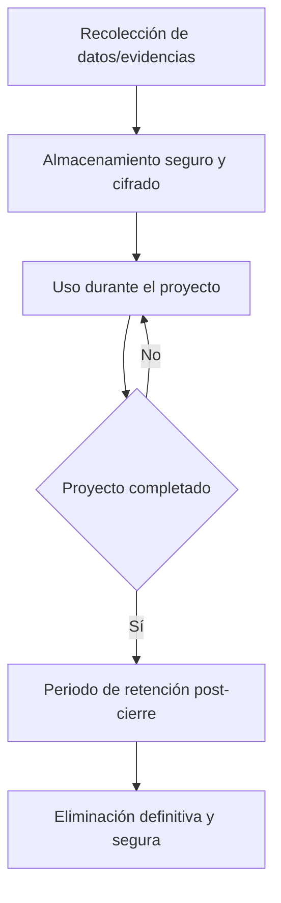

# Retención y Eliminación de Datos

:::info
Esta política define **cuánto tiempo** se almacenan los datos en la plataforma y **cómo** se eliminan de manera segura, en cumplimiento con la legislación argentina y las mejores prácticas de seguridad.
:::

## Objetivos

- **Minimizar** la retención de datos personales y sensibles.
- Mantener datos **solo** mientras sean necesarios para cumplir la finalidad para la que se recopilaron.
- Asegurar la **eliminación definitiva** mediante procedimientos seguros.
- Cumplir con la **Ley 25.326** de Protección de Datos Personales y normativas asociadas.

---

## Ciclo de vida de los datos

---

## Plazos de retención

| Tipo de dato | Retención post-cierre | Método de eliminación |
| ------------ | --------------------- | --------------------- |
| **Evidencias fiscales** (monetarias) | Eliminación inmediata tras cierre aprobado por todos (o luego de unos meses)                | Borrado seguro (wiping y destrucción de clave) |
| **Evidencias no fiscales** (fotos)  | Conservación indefinida salvo eliminación manual por la institución | Eliminación física del archivo y versiones     |
| **Metadatos de actividad** (logs, auditoría)                            | 6 meses post-cierre                                                 | Purga de registros y backup incremental        |
| **Documentación de verificación de identidad**                          | 1 año desde la aprobación o hasta nueva verificación obligatoria    | Borrado seguro + revocación de verificación    |

---

## Eliminación automática y manual

### Eliminación automática

* Las **evidencias fiscales** se eliminan **de inmediato** tras el cierre aprobado por todos los colaboradores, dado que previamente marcaron el checkbox de legitimidad.
* Los **metadatos de auditoría** se conservan 6 meses adicionales para fines de registro.
* La **documentación de verificación de identidad** expira automáticamente y puede requerir **nueva verificación periódica**.

### Eliminación manual

* Las instituciones pueden solicitar la eliminación de **evidencias no fiscales** (ej. fotos de voluntariado) en cualquier momento desde su panel.
* Un administrador puede forzar la eliminación anticipada si detecta contenido que incumpla los Términos y Condiciones.

---

## Verificación periódica de identidad

**Proceso sugerido:**

1. Aviso automático 30 días antes de la expiración.
2. La institución debe volver a cargar documentación válida.
3. Si no se renueva, el estado de verificación pasa a **"Pendiente"** y no podrá publicar proyectos hasta completarla.

---

## Excepciones de eliminación de datos

En casos específicos, la retención puede extenderse más allá de los plazos indicados:

* Procesos judiciales o reclamos legales en curso.
* Solicitud expresa de una autoridad competente.
* Obligaciones fiscales específicas que obliguen a conservar ciertos documentos más tiempo.

---

## Auditoría y transparencia

* Todos los eventos de eliminación son **registrados en un log inmutable** (`HistorialCambios`).
* **Opcional para más transparencia:** los usuarios pueden solicitar un **certificado de eliminación** para constatar que su información fue borrada según la política vigente.

---

## Referencias legales

* [Ley 25.326 - Protección de Datos Personales](https://www.argentina.gob.ar/aaip/datospersonales)